# ✨ Enhanced Feedback Analysis System

A multi-agent NLP platform that extracts rich, structured insights from customer feedback. Beyond basic sentiment analysis, it performs Named Entity Recognition, Sentiment Quintuple Extraction, Coreference Resolution, and Comparative Opinion Mining — powered by agentic LLM workflows.

> 🧠 Domain-agnostic, real-time, and fully extensible.

---

## 🚀 Features

* 🧹 Text Cleaning & Preprocessing
* 🏷️ Named Entity Recognition (NER)
* 📐 Sentiment Quintuple Extraction *(Target, Feature, Sentiment, Opinion Holder, Time)*
* 🔁 Coreference Resolution
* ⚖️ Comparative Opinion Mining
* 📥 CSV & JSON Download Support
* 🧪 Single and Batch Processing Flows
* 🌐 Real-time output via Server-Sent Events

---

## 🧠 System Architecture

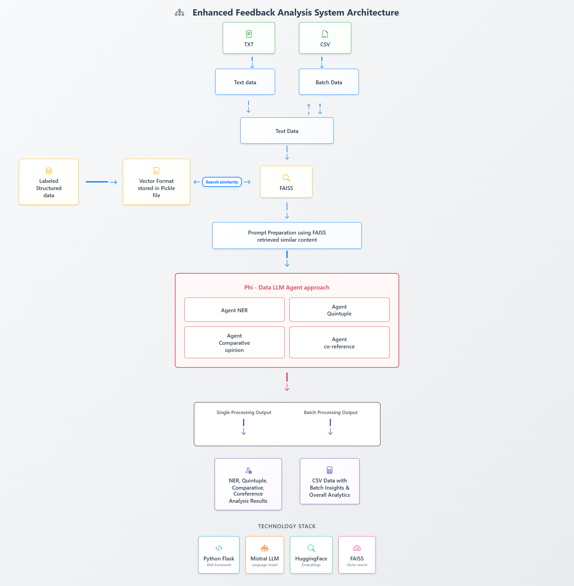

---

## 🛠 Tech Stack

| Layer           | Tools                                |
| --------------- | ------------------------------------ |
| **Frontend**    | HTML, CSS, Bootstrap, Material Icons |
| **Backend**     | Flask, REST API, SSE                 |
| **LLM Agentic** | Mistral + Phidata                    |
| **Vector DB**   | FAISS                                |
| **Embeddings**  | all-MiniLM-L6-v2 (384d)              |
| **Integration** | LangChain + FAISS + SSE              |

---

## 🧰 Tools & Technologies Used

* **Python** — Core programming language
* **Flask** — REST API + SSE backend
* **FAISS** — Vector similarity search
* **all-MiniLM-L6-v2** — Sentence embeddings (384-dim)
* **Mistral** — LLM used for few-shot inference
* **Phidata** — Agent orchestration framework
* **LangChain** — RAG and prompting interface
* **Bootstrap** — Frontend layout
* **Jinja2** — HTML template engine
* **Pandas / CSV / JSON** — File handling and exports
* **Material Icons** — UI visuals
* **Server-Sent Events** — Real-time streaming

---

## 🗂 App Structure

### 📁 Single Review (real-time processing)

```
📁 single/  
├── app.py  
├── extraction_pipeline.py  
├── static/  
│   ├── css/  
│   ├── favicon_io/  
│   └── text/  
├── templates/  
│   ├── index.html  
│   ├── generate_insights.html  
│   ├── generated_insights.html  
│   ├── insights_template.html  
│   └── view_data.html  
├── all-MiniLM-L6-v2/  
│   ├── config.json  
│   ├── model.safetensors  
│   └── ...  
├── faiss_*_embeddings/  
│   ├── index.faiss  
│   └── index.pkl
```

### 📁 Batch Processing (CSV upload and analytics)

```
📁 batch/  
├── app.py  
├── extraction_pipeline.py  
├── static/  
│   ├── css/  
│   ├── favicon_io/  
│   └── text/  
├── templates/  
│   ├── index.html  
│   ├── download.html  
│   ├── generate_insights.html  
│   ├── generated_insights.html  
│   ├── insights_report.html  
│   ├── insights_template.html  
│   ├── old_runs.html  
│   └── view_data.html  
├── uploads/  
│   └── [timestamp]_[filename].csv  
├── processed/  
│   ├── annotations_summary__.csv  
│   ├── insights_overall_summary__.csv  
│   └── latest_run_timestamp.txt  
├── all-MiniLM-L6-v2/  
├── faiss_*_embeddings/
```

---

## 🔎 Single Review Flow

### 📥 Step 1: Review Input

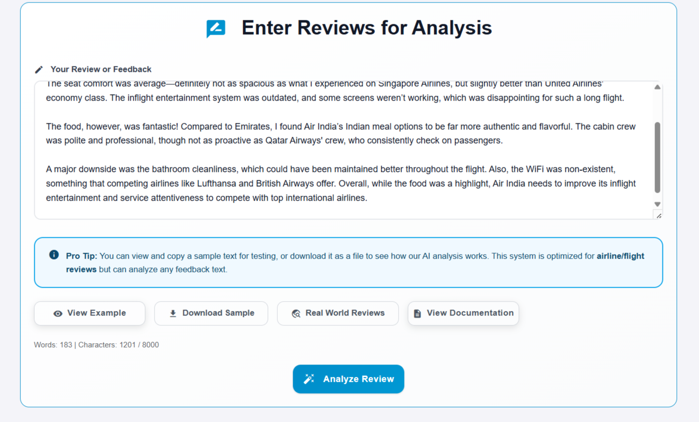

### 🏷️ Step 2: Named Entity Recognition (NER)

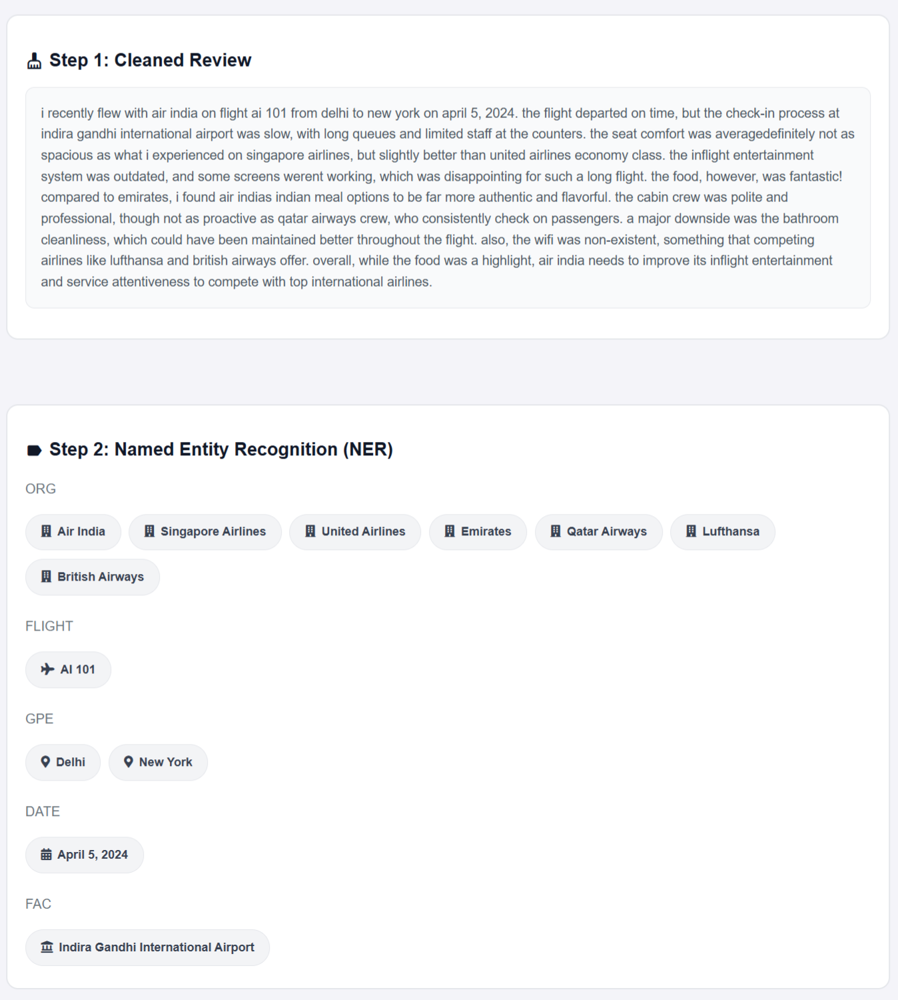

### 🧩 Step 3: Sentiment Quintuples

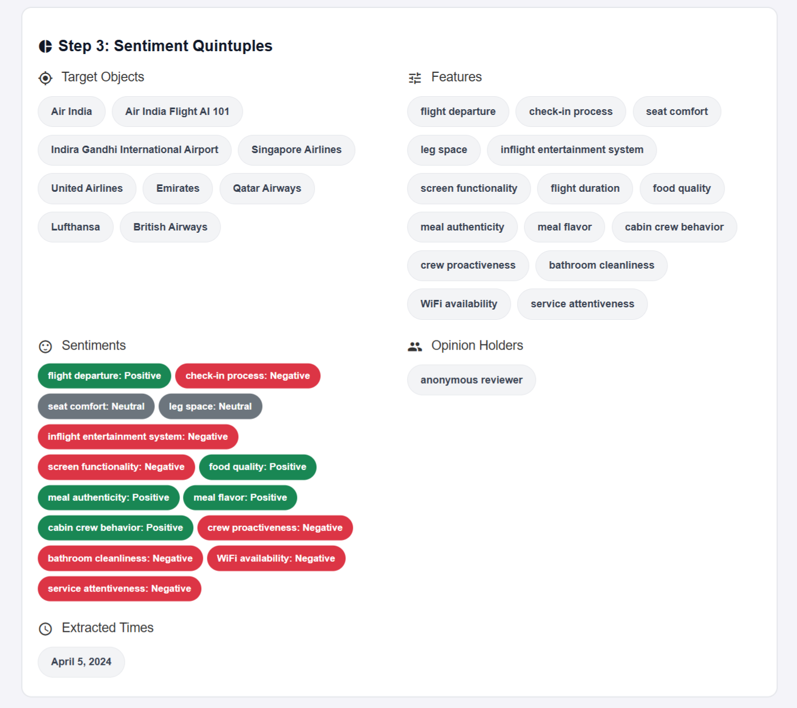

### 🧠 Step 4: Coreference & Comparative Opinion Mining

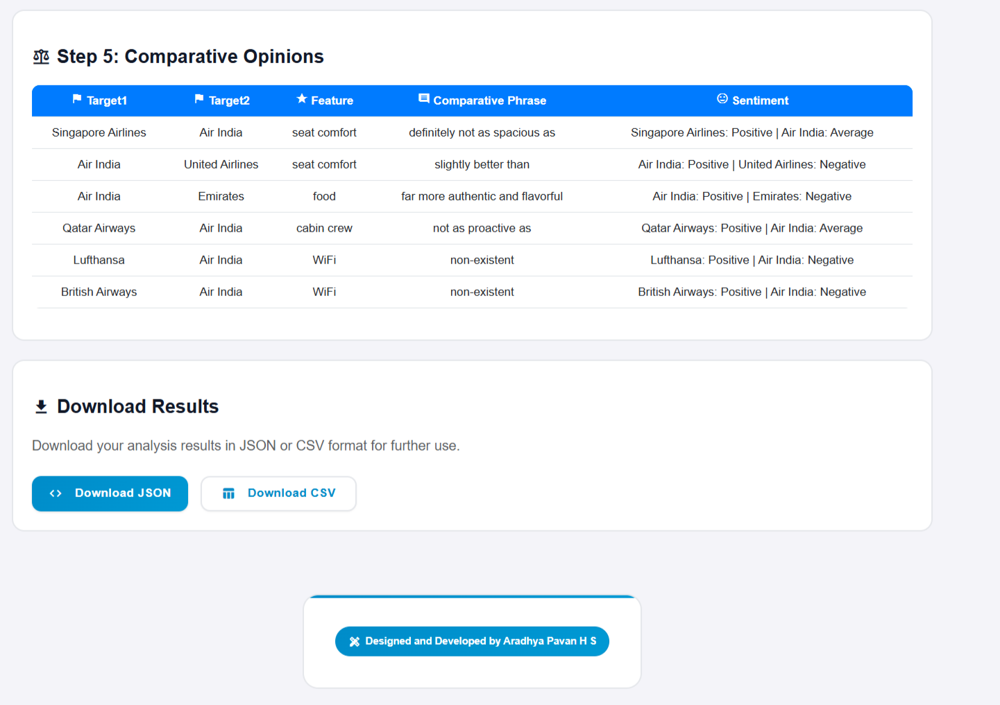

### 📤 Step 5: Download Results

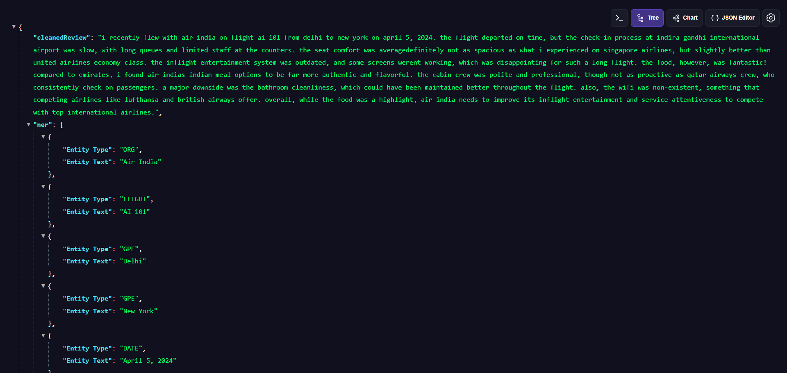

---

## 📁 Batch Review Flow

### 🔼 Step 1: Upload CSV

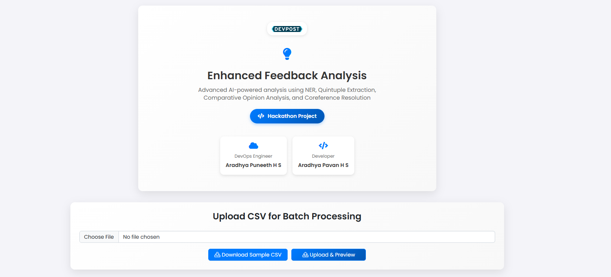

### 👁️ Step 2: Preview Cleaned Reviews

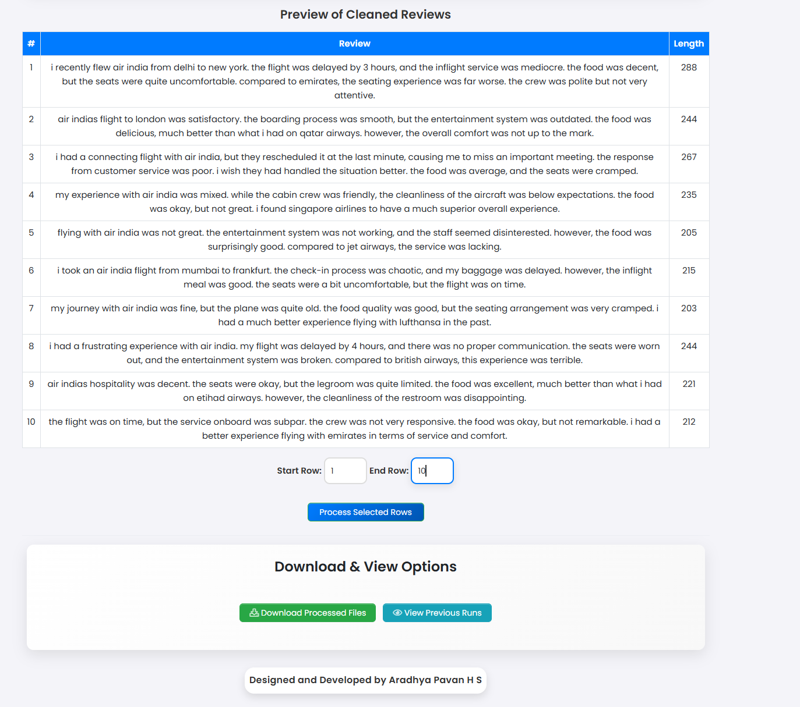

### 📝 Step 3: Annotations Summary per Review

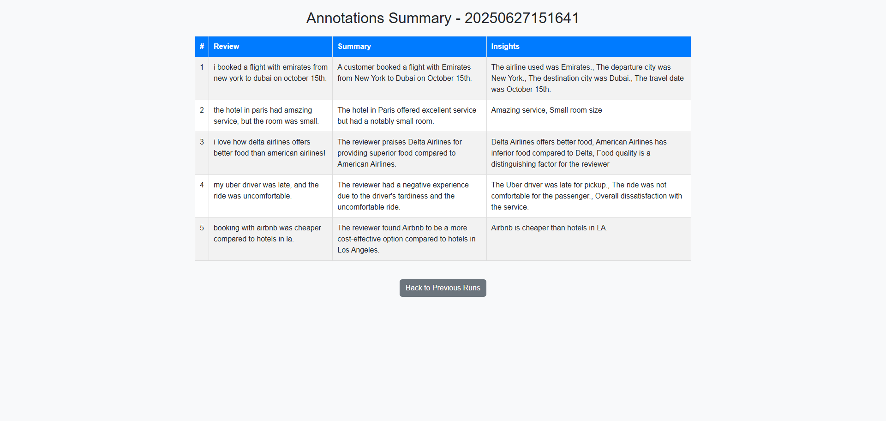

### 📈 Step 4: Generated Insights Summary

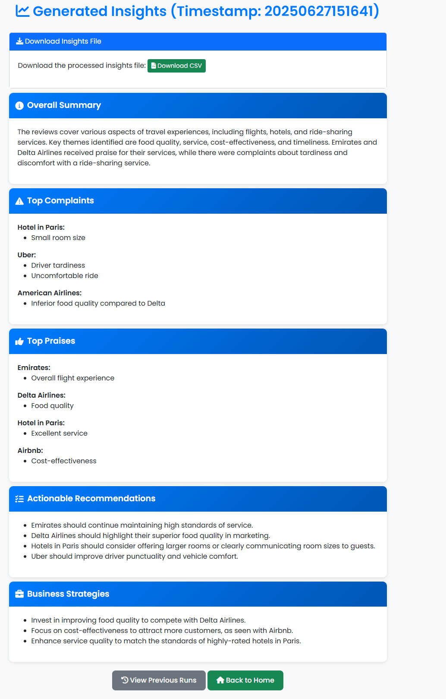

Includes:

* 🧠 Overall Summary
* ❗ Top Complaints
* 👍 Top Praises
* ✅ Actionable Recommendations
* 💡 Business Strategies

### 🕓 Step 5: Previous Runs View

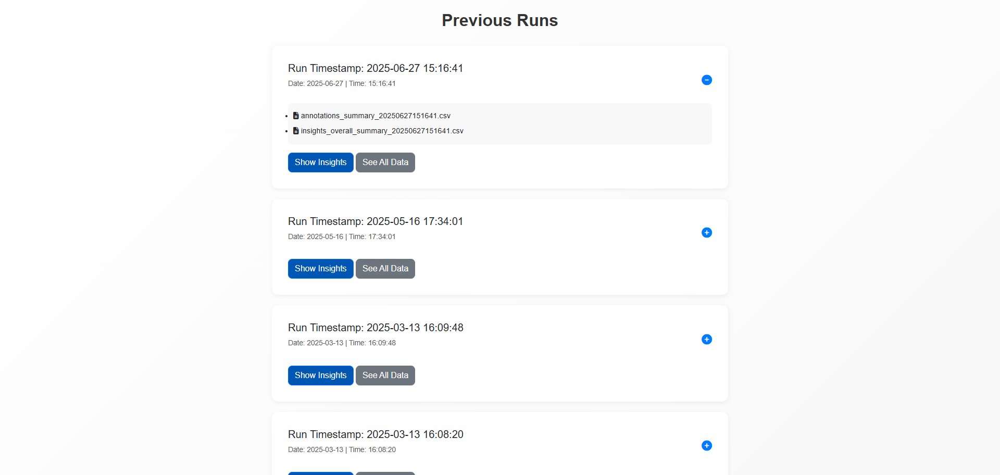

### 💾 Step 6: Download Processed CSVs

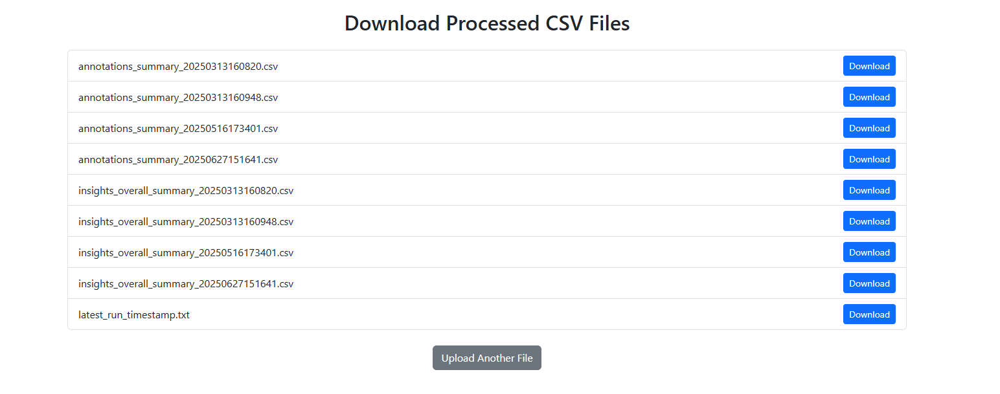

---

## 🧾 CSV Input Format

```csv
Review
"I booked a flight with Emirates from New York to Dubai on October 15th."
"The hotel in Paris had amazing service, but the room was small."
...
```

---

## 🌍 Domain Adaptability


✅ **Trained on airline data but built to be domain-independent.**
To adapt to a new domain:

1. 📝 Annotate new domain reviews
2. 🧠 Generate new embeddings
3. 📦 Replace the FAISS index
4. ✏️ Update prompts to reflect domain-specific terminology and aspects
5. 🔁 Reuse the existing pipeline without modification to core logic

---


## 🌐 Live Deployments

* 🔹 [Single Review UI](https://bits-dissertation-project-sra-2fdf8c78ca1c.herokuapp.com/)
* 🔸 [Batch Review Analysis](https://bits-des-batch-j6ljm.ondigitalocean.app/)

---

## 📄 License

MIT License — Open for use, extension, and collaboration.

---

## 📌 What's Next

- 🌍 **Expand to Multiple Domains**  
  Extend to sectors like healthcare, e-commerce, and finance with new annotated datasets.

- 🚀 **Improve Scalability**  
  Optimize pipelines to handle larger datasets efficiently in production environments.

- 🔍 **Hybrid Search Optimization**  
  Combine FAISS vector search with keyword-based retrieval to enhance precision and recall.

- 🧠 **Fine-Tune LLMs**  
  Apply domain-specific fine-tuning for improved model accuracy and contextual understanding.

- ⚡ **Enhance Real-Time Processing**  
  Boost performance and reduce latency for faster feedback loop integration and live insights.

